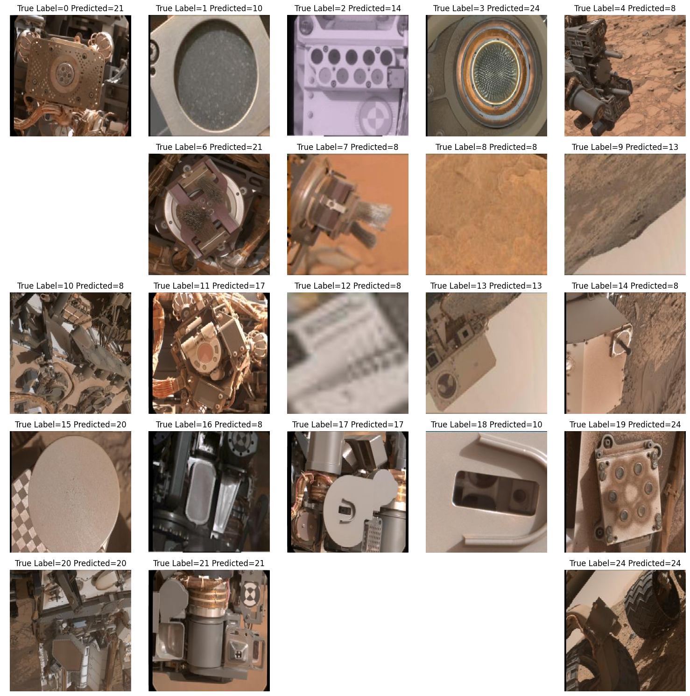
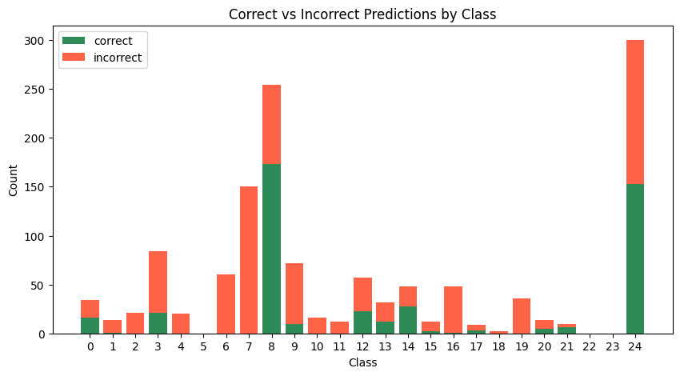
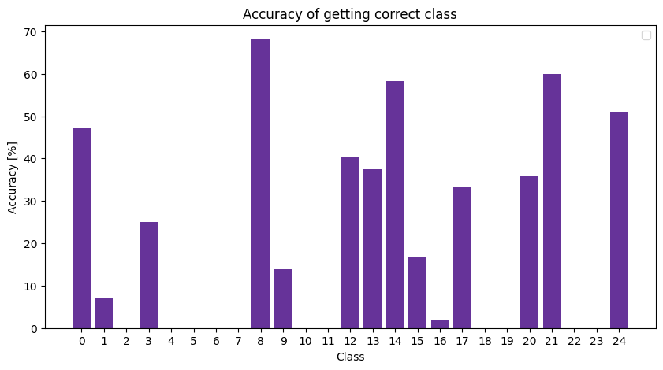
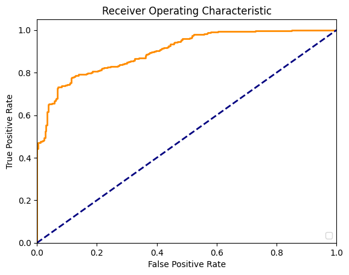
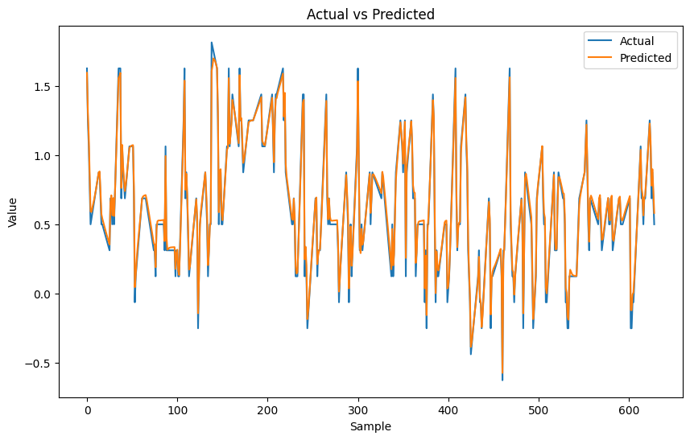
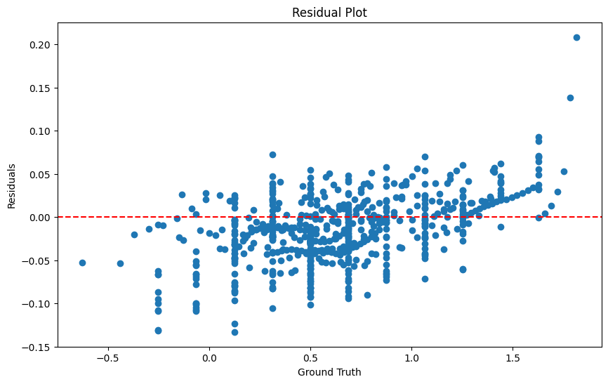

# ML-Projects

<h2> Mars Rover Image Classification CNN</h2>

Machine Learning Project to classify images taken by the Curiosity Mars Rover into 25 categories.

 - Trained and developed Convolutional Neural Network (CNN) using classification
 - Optimised batch loading to reduce runtime
 - Experimented with optimal network Architecture
 - Evaluated the model using confusion matrices and ROC curves for binary models

<h2> Raccoon Temperature Time Series RNN</h2>

Machine Learning Project to predict the time series of racoon temperature from GPS tracking data

 - Explored through range of animal tracking data to choose optimal data through visualisation
 - Preprocessed data to identify inconsistencies by interpolating
 - Developed and trained Recurrent Neural Network (RNN) for forecast time series to predict temperature
 - Evaluated the model achieving Mean Absolute Error (MAE) of 0.13% unseen test data as well as using residual analysis

